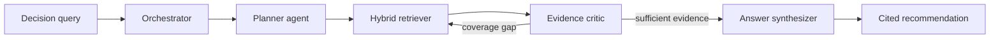

# AtlasTrace — Multi-Agent Agentic RAG Decision Room

An evidence-first Agentic RAG system that turns a contested business decision into an **auditable answer**: every recommendation shows the queries that were planned, the passages that were retrieved, the critique that rejected weak coverage, and the source behind each claim.

[](https://github.com/nguyenddung/RAG/actions/workflows/ci.yml)
[](https://nextjs.org)
[](https://www.typescriptlang.org)
[](LICENSE)

**[Live demo](https://atlastrace-agentic-rag.vercel.app)** · [The problem](#the-problem) · [Architecture](#architecture) · [Run locally](#run-locally) · [Deploy](#deploy-to-vercel)

---

## The problem

A fleet-rollout decision is not a search problem. Operations leaders have to reconcile evidence that lives in different systems and openly disagrees:

| Stakeholder | Evidence | Direction |
| --- | --- | --- |
| Operations | 18% less unplanned downtime in the pilot | supports |
| Finance | €1.4M year-one cost, 19-month payback | supports |
| Data Platform | 37% of the fleet below telemetry threshold | opposes |
| Risk & Compliance | human approval required for safety work orders | constrains |
| Legal | EU worker-privacy limits on telemetry | constrains |

A single-pass RAG chatbot returns a plausible summary and quietly omits the counter-evidence. For a safety-relevant rollout, the team needs a **decision trail**: what was searched, what was selected, what was challenged, and which source grounds each claim.

AtlasTrace makes that process visible.

## What makes it *agentic*

Four specialized agents in a corrective loop — not one prompt wrapped around vector search.



| Stage | Responsibility | Typed output |
| --- | --- | --- |
| **Orchestrator** | Classifies the query, records every handoff and duration | `AgentTrace[]` |
| **Planner agent** | Decomposes the decision into benefit, readiness, cost, governance and counter-evidence queries | `{ intent, queries, successCriteria }` |
| **Hybrid retriever** | BM25 + concept-expanded feature vectors, merged with reciprocal rank fusion | `RetrievedDocument[]` |
| **Evidence critic** | Grades relevance, source diversity and risk coverage; can trigger a **corrective second retrieval** | `{ acceptedIds, confidence, critique, missingPerspective }` |
| **Answer synthesizer** | Receives only accepted evidence; must cite exact document IDs | `{ answer, citedIds, confidence }` |

The critic is what makes the loop corrective: when it reports a `missingPerspective`, retrieval runs again with that perspective appended before synthesis is allowed to start.

### Two execution modes

| Mode | How it runs | Why it exists |
| --- | --- | --- |
| **Demo** (default) | Deterministic planning, retrieval, evidence selection and citation contract — no network, no keys | A recruiter can open the live URL and get a real answer instantly, with zero API quota |
| **Live AI** | Three typed `ToolLoopAgent` instances through Vercel AI Gateway | Shows the real multi-agent pipeline with a hosted model |

Live mode degrades gracefully: any gateway error is caught, the deterministic pipeline completes the run, and the UI shows a `fallback` banner with the reason instead of an error page.

## Highlights

- A decision workspace, not a generic chat UI
- Visible query decomposition and agent handoffs with per-stage latency
- Hybrid lexical + vector retrieval with reciprocal rank fusion
- Corrective critique loop with explicit counter-evidence coverage
- Clickable source-level citations with `support` / `context` / `risk` stance labels
- Graceful degradation from Live AI to a deterministic pipeline
- Typed API boundary with Zod validation, unit tests, CI, and production deployment
- Responsive down to mobile

## Architecture

```text
app/
├── api/research/route.ts       # Zod-validated research endpoint (POST)
├── layout.tsx                  # metadata, fonts
├── page.tsx                    # server-rendered initial decision
└── globals.css                 # design system
components/
└── research-studio.tsx         # the observable decision room
lib/
├── agents/research-team.ts     # planner, critic, synthesizer, orchestration
└── rag/
    ├── corpus.ts               # synthetic Northstar knowledge base (8 docs)
    ├── retrieval.ts            # BM25 + feature-hashed vectors + RRF
    ├── deterministic.ts        # no-key pipeline + planning contract
    ├── types.ts                # shared pipeline types
    └── retrieval.test.ts       # retrieval and citation invariants
```

The corpus is deliberately **synthetic**. It models a realistic internal knowledge base without exposing proprietary information or implying that the company, metrics or documents are real.

### API

```http
POST /api/research
Content-Type: application/json

{ "question": "Should Northstar roll out predictive maintenance across its EU fleet?",
  "mode": "demo" }
```

`question` must be 12–500 characters. `mode` is `"demo"` or `"live"`. The response is a `ResearchResult`: answer, confidence, planned queries, citations, per-agent trace and pipeline metrics.

## Run locally

```bash
git clone https://github.com/nguyenddung/RAG.git
cd RAG
npm install
npm run dev
```

Open <http://localhost:3000>. **Demo mode needs no environment variables.**

To use Live AI outside Vercel, copy `.env.example` to `.env.local` and set a key:

| Variable | Required | Purpose |
| --- | --- | --- |
| `AI_GATEWAY_API_KEY` | Live mode only, outside Vercel | Vercel AI Gateway credential. Vercel deployments authenticate via OIDC automatically |
| `RESEARCH_MODEL_ID` | No | Swap the model behind all three agents, e.g. `anthropic/claude-opus-5` |
| `NEXT_PUBLIC_SITE_URL` | No | Canonical URL for metadata; inferred from `VERCEL_PROJECT_PRODUCTION_URL` on Vercel |

### Scripts

| Command | What it does |
| --- | --- |
| `npm run dev` | Development server |
| `npm run build` / `npm start` | Production build and server |
| `npm run typecheck` | `tsc --noEmit`, strict mode |
| `npm test` | Vitest unit suite |
| `npm run lint` | ESLint (`eslint-config-next`) |
| `npm run verify` | typecheck → test → lint → build, the same gate CI runs |

## Evaluation strategy

The automated suite protects four invariants that matter more than snapshot tests:

1. Rollout questions generate readiness, risk **and** financial retrieval paths.
2. Retrieval surfaces both supporting evidence and counter-evidence.
3. **Every rendered citation exists in the evidence ledger** — no fabricated document IDs.
4. Production-control questions return control-specific evidence.

The UI surfaces the metrics that would become an offline evaluation set in a production system: evidence coverage, source diversity, citation validity, corrective rounds, grounded confidence and end-to-end latency.

`.github/workflows/ci.yml` runs typecheck, tests, lint and build on every push and pull request.

## Deploy to Vercel

1. Push this repository to GitHub.
2. In Vercel, **Add New → Project** and import `nguyenddung/RAG`.
3. Accept the detected Next.js settings — no environment variables are needed for Demo mode.
4. For Live AI, enable AI Gateway on the project; deployments authenticate via OIDC, so no key needs to be stored.

Every push to `main` then ships a new production deployment.

## Trade-offs and next steps

- **In-memory corpus.** Deliberate, so the demo runs anywhere with zero setup. A production version would ingest versioned documents into Postgres/pgvector or a managed vector store behind the same `retrieveHybrid` interface.
- **Feature-hashed vectors.** Concept expansion plus feature hashing keeps the demo deterministic and dependency-light. Real embeddings drop in behind the same retriever interface without touching the agents.
- **No rate limiting yet.** Public Live AI should add durable rate limiting and per-session budgets before taking real traffic.
- **Next evaluation milestone.** A labeled decision-query set scored on retrieval recall@k, citation precision, faithfulness and answer completeness.

## Summary

> Built and deployed a multi-agent Agentic RAG decision-support system with Next.js, the Vercel AI SDK and AI Gateway. Implemented query planning, BM25/vector hybrid retrieval with reciprocal rank fusion, an evidence-critique retry loop, grounded synthesis with citation auditing, deterministic fallback, and an observable UI — with strict TypeScript, unit tests and CI.

## License

[MIT](LICENSE)
