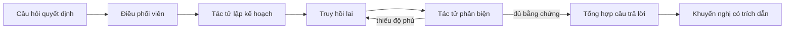

# AtlasTrace — Phòng Quyết Định Agentic RAG Đa Tác Tử

🇬🇧 [Read in English](README.md)

Một hệ thống Agentic RAG lấy bằng chứng làm gốc, biến một quyết định kinh doanh nhiều tranh cãi thành **câu trả lời có thể kiểm chứng**: mọi khuyến nghị đều hiển thị các truy vấn đã được lập kế hoạch, các đoạn tài liệu đã được truy hồi, lượt phản biện đã loại bỏ bằng chứng yếu, và nguồn gốc đứng sau từng luận điểm. Toàn bộ sản phẩm chạy được bằng **cả tiếng Anh lẫn tiếng Việt** — kể cả ở khâu truy hồi dữ liệu.

[](https://github.com/nguyenddung/atlastrace-agentic-rag/actions/workflows/ci.yml)
[](https://nextjs.org)
[](https://www.typescriptlang.org)
[](LICENSE)

**[Xem demo trực tiếp](https://atlastrace-ten.vercel.app)** · [Vấn đề](#vấn-đề) · [Kiến trúc](#kiến-trúc) · [Nguồn dữ liệu](#nguồn-dữ-liệu) · [Chạy ở máy local](#chạy-ở-máy-local) · [Triển khai](#triển-khai-lên-vercel)

> Bản demo trực tiếp chạy ở chế độ Demo, nên không cần API key và không bao giờ hết quota — hãy mở link và đặt câu hỏi bằng tiếng Anh hoặc tiếng Việt.

---

## Vấn đề

Một quyết định triển khai đội xe không phải là bài toán tìm kiếm đơn thuần. Lãnh đạo vận hành phải dung hòa bằng chứng nằm rải rác ở nhiều hệ thống khác nhau và công khai mâu thuẫn với nhau:

| Bên liên quan | Bằng chứng | Xu hướng |
| --- | --- | --- |
| Vận hành | Giảm 18% thời gian dừng ngoài kế hoạch trong pilot | ủng hộ |
| Tài chính | Chi phí €1,4M năm đầu, hoàn vốn sau 19 tháng | ủng hộ |
| Nền tảng dữ liệu | 37% đội xe chưa đạt ngưỡng telemetry | phản đối |
| Rủi ro & Tuân thủ | bắt buộc con người phê duyệt lệnh công việc an toàn | ràng buộc |
| Pháp lý | quyền riêng tư người lao động EU giới hạn việc thu thập telemetry | ràng buộc |

Một chatbot RAG một lượt sẽ trả về một bản tóm tắt nghe có vẻ hợp lý và âm thầm bỏ sót phần bằng chứng phản bác. Với một quyết định liên quan đến an toàn, đội ngũ cần một **dấu vết quyết định**: đã tìm gì, đã chọn gì, đã bị phản biện điều gì, và nguồn nào làm căn cứ cho từng luận điểm.

AtlasTrace làm cho toàn bộ quá trình đó trở nên minh bạch.

## Điều gì khiến hệ thống này thực sự "agentic"

Bốn tác tử (agent) chuyên biệt hoạt động trong một vòng lặp có khả năng tự sửa sai — không phải một prompt bọc quanh vector search.



| Khâu | Vai trò | Đầu ra định kiểu |
| --- | --- | --- |
| **Điều phối** | Phân loại câu hỏi, ghi lại mọi lượt bàn giao và thời lượng | `AgentTrace[]` |
| **Lập kế hoạch truy vấn** | Tách quyết định thành các truy vấn về lợi ích, mức sẵn sàng, chi phí, quản trị và bằng chứng phản bác | `{ intent, queries, successCriteria }` |
| **Truy hồi lai** | BM25 + vector mở rộng khái niệm, hợp nhất bằng reciprocal rank fusion | `RetrievedDocument[]` |
| **Phản biện bằng chứng** | Chấm điểm độ liên quan, độ đa dạng nguồn và độ phủ rủi ro; có thể kích hoạt **lượt truy hồi sửa sai lần hai** | `{ acceptedIds, confidence, critique, missingPerspective }` |
| **Tổng hợp câu trả lời** | Chỉ nhận bằng chứng đã được chấp nhận; bắt buộc trích dẫn đúng ID tài liệu | `{ answer, citedIds, confidence }` |

Chính tác tử phản biện là thứ khiến vòng lặp có khả năng tự sửa sai: khi nó báo cáo một `missingPerspective`, hệ thống truy hồi lại lần nữa với góc nhìn còn thiếu đó trước khi cho phép bước tổng hợp bắt đầu.

### Hai chế độ vận hành

| Chế độ | Cách hoạt động | Lý do tồn tại |
| --- | --- | --- |
| **Demo** (mặc định) | Lập kế hoạch, truy hồi, chọn bằng chứng và hợp đồng trích dẫn hoàn toàn tất định — không gọi mạng, không cần key | Nhà tuyển dụng mở link demo là có ngay câu trả lời thật, không tốn quota API nào |
| **AI trực tiếp** | Ba instance `ToolLoopAgent` định kiểu, chạy qua Vercel AI Gateway | Cho thấy pipeline đa tác tử thật, chạy với một mô hình được host thật sự |

Chế độ trực tiếp suy giảm một cách êm ái: mọi lỗi từ gateway đều được bắt lại, pipeline tất định hoàn tất lượt chạy thay thế, và giao diện hiển thị một banner `fallback` kèm lý do — thay vì một trang lỗi.

## Điểm nổi bật

- Một không gian làm việc cho quyết định, không phải một khung chat chung chung
- Quá trình tách nhỏ truy vấn và bàn giao giữa các tác tử được hiển thị rõ ràng, kèm độ trễ từng khâu
- Truy hồi lai kết hợp lexical (BM25) và vector, hợp nhất bằng reciprocal rank fusion
- Vòng lặp phản biện có khả năng tự sửa sai, với độ phủ bằng chứng phản bác tường minh
- Trích dẫn cấp nguồn có thể bấm vào, kèm nhãn lập trường `support` / `context` / `risk`
- Suy giảm êm ái từ AI trực tiếp về pipeline tất định khi có sự cố
- Song ngữ hoàn toàn Anh/Việt — giao diện, câu trả lời, sổ bằng chứng **và cả khâu truy hồi**
- Ranh giới API được định kiểu với Zod, có unit test, CI, và đã triển khai production
- Responsive tốt xuống tới mobile
- Giới hạn tần suất gọi API theo từng IP, cùng favicon, ảnh chia sẻ mạng xã hội (OG image), robots.txt và sitemap được sinh tự động

## Song ngữ, kể cả ở khâu truy hồi

Dịch giao diện chỉ là nửa dễ. Nửa khó là **BM25 chấm điểm theo từ khớp chính xác**, nên một câu hỏi tiếng Việt chạy trên kho tài liệu tiếng Anh sẽ chỉ truy hồi ra nhiễu — một nút chuyển ngôn ngữ chỉ đổi nhãn nút bấm sẽ âm thầm cho ra câu trả lời tệ hơn ở một trong hai ngôn ngữ.

Có ba hướng tiếp cận khả thi:

| Hướng tiếp cận | Vì sao không chọn |
| --- | --- |
| Dịch cả kho tài liệu | Phá vỡ khả năng chấm điểm lexical — không thể vừa BM25 một truy vấn tiếng Việt trên văn bản tiếng Việt, vừa BM25 một truy vấn tiếng Anh trên văn bản tiếng Anh, từ cùng một chỉ mục |
| Thêm một chỉ mục embedding đa ngôn ngữ thứ hai | Là câu trả lời đúng ở quy mô lớn, nhưng là một dependency nặng cho kho chỉ 8 tài liệu, và làm mất tính tất định, không cần API key của bản demo |
| Bắc cầu truy vấn vào một không gian khái niệm chung | Giữ được một chỉ mục duy nhất, vẫn tất định, và trung thực về giới hạn của nó |

AtlasTrace chọn hướng thứ ba. `lib/rag/language-bridge.ts` chuẩn hóa dấu thanh tiếng Việt và ký tự `đ`, sau đó ánh xạ từ vựng nghiệp vụ tiếng Việt vào đúng không gian khái niệm tiếng Anh mà bộ truy hồi đã đánh chỉ mục:

```text
"triển khai"  → rollout deploy launch
"chi phí"     → cost investment
"kiểm soát"   → control governance oversight
```

Việc ánh xạ chỉ áp dụng cho cụm nhiều âm tiết — một âm tiết tiếng Việt đơn lẻ quá mơ hồ để ánh xạ an toàn. Một câu hỏi tiếng Anh không chứa cụm từ tiếng Việt nào, nên nó được "bắc cầu" về chính nó, không đổi gì cả, hành vi cũ hoàn toàn không bị ảnh hưởng.

Ngôn ngữ được xử lý ở đâu:

| Tầng | Cách xử lý ngôn ngữ |
| --- | --- |
| Chỉ mục truy hồi (`lib/rag/corpus.ts`) | Giữ nguyên tiếng Anh — đây là thứ BM25 chấm điểm |
| Truy vấn | Được bắc cầu vào không gian khái niệm tiếng Anh trước khi tách token |
| Sổ bằng chứng, câu trả lời, kết luận, dấu vết tác tử | Hiển thị theo ngôn ngữ người đọc chọn |
| Chuỗi giao diện | `lib/i18n/dictionary.ts`, một từ điển định kiểu cho mỗi ngôn ngữ |

Cả hai ngôn ngữ đều được render sẵn phía server ngay từ lần tải đầu, nên nút chuyển ngôn ngữ phản hồi tức thì. Khi người đọc đã tự đặt câu hỏi của riêng mình, việc đổi ngôn ngữ sẽ chạy lại câu hỏi đó thay vì hiển thị một câu trả lời cũ sai ngôn ngữ.

## Kiến trúc

```text
app/
├── api/research/route.ts       # Endpoint nghiên cứu (POST), validate bằng Zod, có rate limit
├── layout.tsx                  # metadata, font chữ
├── page.tsx                    # kết quả khởi tạo render sẵn phía server
├── icon.tsx / opengraph-image.tsx  # favicon và ảnh chia sẻ mạng xã hội sinh tự động
├── robots.ts / sitemap.ts      # các file SEO sinh tự động
└── globals.css                 # hệ thống thiết kế (design system)
components/
└── research-studio.tsx         # phòng quyết định có thể quan sát được
lib/
├── agents/research-team.ts     # tác tử lập kế hoạch, phản biện, tổng hợp, điều phối
├── rate-limit.ts                # bộ giới hạn tần suất theo IP, lưu trong bộ nhớ
├── site.ts                      # URL chính thức của site, dùng chung cho metadata/robots/sitemap
├── i18n/
│   ├── locale.ts               # kiểu Locale và các hàm kiểm tra
│   ├── dictionary.ts           # từ điển giao diện Anh/Việt định kiểu
│   └── corpus-vi.ts            # lớp trình bày tiếng Việt cho kho tài liệu
└── rag/
    ├── corpus.ts               # kho tri thức tổng hợp Northstar (8 tài liệu, tiếng Anh)
    ├── retrieval.ts            # BM25 + vector feature-hashing + RRF
    ├── language-bridge.ts      # cầu nối ngôn ngữ Việt → Anh
    ├── deterministic.ts        # pipeline không cần key, lập kế hoạch và phân loại
    ├── types.ts                # các kiểu dữ liệu dùng chung cho pipeline
    └── retrieval.test.ts       # test bất biến cho truy hồi, trích dẫn và tính song ngữ
```

Kho tài liệu được thiết kế **tổng hợp một cách có chủ đích**. Nó mô phỏng một kho tri thức nội bộ thực tế mà không để lộ thông tin độc quyền hay ngụ ý rằng công ty, số liệu hoặc tài liệu là có thật.

## Nguồn dữ liệu

Dự án này **không** gọi tới bất kỳ dataset ngoài, database hay trình thu thập dữ liệu (scraper) nào cả. Toàn bộ kho tri thức là một tập tài liệu tổng hợp, do chính tay viết ra và nằm sẵn ngay trong repo:

- [`lib/rag/corpus.ts`](lib/rag/corpus.ts) — 8 tài liệu tiếng Anh (`OPS-17`, `FIN-08`, `RISK-12`, `LEGAL-04`, `ENG-23`, `DATA-05`, `SRE-19`, `PEOPLE-03`), mỗi tài liệu có id, tiêu đề, nguồn, ngày tháng, tag, lập trường `support` / `context` / `risk` và một đoạn văn bản. Đây chính xác là mảng dữ liệu mà `retrieveHybrid` đánh chỉ mục và chấm điểm — không có gì được gọi qua mạng lúc runtime cả.
- [`lib/i18n/corpus-vi.ts`](lib/i18n/corpus-vi.ts) — bản dịch tiếng Việt của đúng 8 tài liệu đó, dùng chung id. File này chỉ dùng để hiển thị: việc chấm điểm truy hồi luôn chạy trên văn bản tiếng Anh ở trên, file này chỉ đổi những gì người đọc tiếng Việt nhìn thấy trong sổ bằng chứng.

Toàn bộ nội dung trong kho tài liệu đều là **hư cấu** — không đại diện cho bất kỳ công ty, nhân viên hay số liệu độc quyền có thật nào; "Northstar" và "FleetSense" là những cái tên được đặt ra cho một kịch bản triển khai bảo trì đội xe hoàn toàn tổng hợp. Muốn trỏ dự án này vào dữ liệu thật, chỉ cần cài đặt một nguồn lưu trữ có cùng chữ ký hàm `retrieveHybrid(question, plannedQueries, limit)` (xem [Đánh đổi kỹ thuật & bước tiếp theo](#đánh-đổi-kỹ-thuật--bước-tiếp-theo)) — các tác tử, API và giao diện đều không cần thay đổi gì.

### API

```http
POST /api/research
Content-Type: application/json

{ "question": "Northstar có nên triển khai bảo trì dự đoán cho toàn đội xe EU không?",
  "mode": "demo",
  "locale": "vi" }
```

`question` phải dài 12–500 ký tự. `mode` là `"demo"` hoặc `"live"`. `locale` là `"en"` hoặc `"vi"`, mặc định `"en"`. Kết quả trả về là một `ResearchResult`: kết luận, câu trả lời, độ tin cậy, các truy vấn đã lập kế hoạch, trích dẫn, dấu vết từng tác tử và các chỉ số pipeline — tất cả theo đúng ngôn ngữ yêu cầu. Lỗi validate cũng được bản địa hóa. Yêu cầu bị giới hạn theo từng IP (20 lượt/phút); vượt quá sẽ trả về `429` kèm header `Retry-After`.

## Chạy ở máy local

```bash
git clone https://github.com/nguyenddung/atlastrace-agentic-rag.git
cd atlastrace-agentic-rag
npm install
npm run dev
```

Mở <http://localhost:3000>. **Chế độ Demo không cần bất kỳ biến môi trường nào.**

Để dùng chế độ AI trực tiếp bên ngoài Vercel, copy `.env.example` thành `.env.local` và điền key:

| Biến | Bắt buộc | Mục đích |
| --- | --- | --- |
| `AI_GATEWAY_API_KEY` | Chỉ cần cho chế độ Live, khi chạy ngoài Vercel | Credential cho Vercel AI Gateway. Trên Vercel, việc xác thực diễn ra tự động qua OIDC |
| `RESEARCH_MODEL_ID` | Không | Đổi mô hình đứng sau cả ba tác tử mà không cần sửa code, vd. `anthropic/claude-opus-5` |
| `NEXT_PUBLIC_SITE_URL` | Không | URL chính thức dùng cho metadata; tự suy ra từ `VERCEL_PROJECT_PRODUCTION_URL` khi chạy trên Vercel |

### Các lệnh script

| Lệnh | Chức năng |
| --- | --- |
| `npm run dev` | Chạy server phát triển |
| `npm run build` / `npm start` | Build và chạy bản production |
| `npm run typecheck` | `tsc --noEmit`, chế độ strict |
| `npm test` | Bộ unit test Vitest |
| `npm run lint` | ESLint (`eslint-config-next`) |
| `npm run verify` | typecheck → test → lint → build, đúng cổng kiểm tra mà CI chạy |

## Chiến lược đánh giá

Bộ test tự động bảo vệ những bất biến quan trọng hơn nhiều so với snapshot test đơn thuần:

1. Câu hỏi về triển khai luôn sinh ra các nhánh truy hồi về mức sẵn sàng, rủi ro **và** tài chính.
2. Kết quả truy hồi luôn có cả bằng chứng ủng hộ lẫn bằng chứng phản bác.
3. **Mọi trích dẫn hiển thị đều tồn tại trong sổ bằng chứng** — không có ID tài liệu bịa đặt.
4. Câu hỏi về kiểm soát production luôn trả về đúng bằng chứng liên quan đến kiểm soát.
5. Một câu hỏi tiếng Việt được phân loại giống hệt câu hỏi tiếng Anh tương đương.
6. Cầu nối ngôn ngữ thực sự có vai trò: token tiếng Việt gốc không mang thông tin gì để chỉ mục tiếng Anh chấm điểm, nhưng token sau khi bắc cầu thì có.
7. Câu hỏi tiếng Việt truy hồi ra gần như cùng một tập bằng chứng với câu hỏi tiếng Anh tương đương, có cả bằng chứng ủng hộ lẫn phản bác.
8. Kết quả theo ngôn ngữ nào thì giữ nguyên ngôn ngữ đó cho kết luận, câu trả lời, sổ bằng chứng và dấu vết tác tử — trong khi trích dẫn vẫn hợp lệ.

Giao diện hiển thị đúng những chỉ số mà một hệ thống production thực sự sẽ dùng làm bộ đánh giá offline: độ phủ bằng chứng, độ đa dạng nguồn, tính hợp lệ của trích dẫn, số vòng sửa sai và độ trễ đầu-cuối.

`.github/workflows/ci.yml` chạy typecheck, test, lint và build trên mỗi lần push và mỗi pull request.

## Triển khai lên Vercel

Repository này đang được triển khai tại **[atlastrace-ten.vercel.app](https://atlastrace-ten.vercel.app)**. Để triển khai bản của riêng bạn:

1. Push repository này lên GitHub.
2. Trên Vercel, chọn **Add New → Project** và import `nguyenddung/atlastrace-agentic-rag`.
3. Chấp nhận cấu hình Next.js được tự động phát hiện — không cần biến môi trường nào cho chế độ Demo.
4. Để dùng AI trực tiếp, bật AI Gateway cho project; các lần deploy sẽ tự xác thực qua OIDC, không cần lưu key nào cả.

Mỗi lần push lên `main` sẽ tự động phát hành một bản triển khai production mới.

## Đánh đổi kỹ thuật & bước tiếp theo

- **Kho tài liệu lưu trong bộ nhớ.** Đây là lựa chọn có chủ đích, để bản demo chạy được ở bất cứ đâu mà không cần cài đặt gì. Bản production thực sự sẽ nạp tài liệu có versioning vào Postgres/pgvector hoặc một managed vector store, đứng sau cùng interface `retrieveHybrid`.
- **Vector dùng feature hashing.** Kết hợp mở rộng khái niệm với feature hashing giúp bản demo vừa tất định vừa nhẹ dependency. Embedding thật có thể thay thế ngay sau cùng interface bộ truy hồi mà không cần đụng vào các tác tử.
- **Cầu nối ngôn ngữ là một từ điển, không phải một bộ dịch.** Nó bao phủ đúng từ vựng nghiệp vụ mà kho tài liệu này đề cập. Tiếng Việt ngoài phạm vi đó sẽ chỉ còn lại những token nào "sống sót", và giải pháp trung thực ở quy mô lớn là một chỉ mục embedding đa ngôn ngữ, đứng sau cùng interface `retrieveHybrid`.
- **Rate limiting lưu trong bộ nhớ, chưa bền vững.** `/api/research` áp dụng giới hạn theo cửa sổ cố định trên từng IP (`lib/rate-limit.ts`), nhưng trạng thái này bị reset mỗi khi instance khởi động lại và không được chia sẻ giữa các instance serverless. Nó đủ để hạn chế lạm dụng thông thường với bản demo công khai; traffic production thật cần một kho lưu trữ bền vững, dùng chung (Vercel KV, Upstash) đứng sau cùng interface.
- **Cột mốc đánh giá tiếp theo.** Xây một bộ câu hỏi quyết định có gán nhãn, chấm điểm theo recall@k của truy hồi, độ chính xác trích dẫn, độ trung thực và độ đầy đủ của câu trả lời.

## Tóm tắt (dùng cho CV)

> Xây dựng và triển khai một hệ thống hỗ trợ ra quyết định Agentic RAG đa tác tử bằng Next.js, Vercel AI SDK và AI Gateway. Cài đặt lập kế hoạch truy vấn, truy hồi lai BM25/vector với reciprocal rank fusion, vòng lặp phản biện-truy hồi lại bằng chứng, tổng hợp câu trả lời có căn cứ kèm kiểm toán trích dẫn, cơ chế dự phòng tất định, truy hồi song ngữ Anh/Việt liên ngôn ngữ, và một giao diện có thể quan sát được toàn bộ quá trình suy luận — cùng với TypeScript strict, unit test và CI.

## Lịch sử star

Nếu dự án này hữu ích với bạn, một star sẽ giúp người khác tìm thấy nó dễ hơn.

[](https://star-history.com/#nguyenddung/atlastrace-agentic-rag&Date)

## Giấy phép

[MIT](LICENSE)
